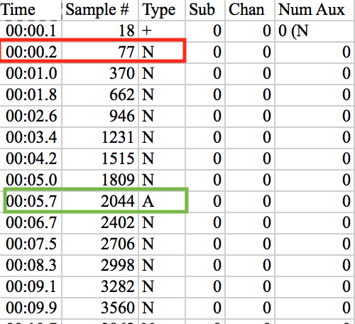
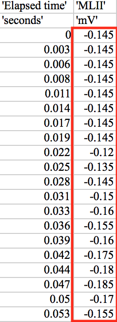
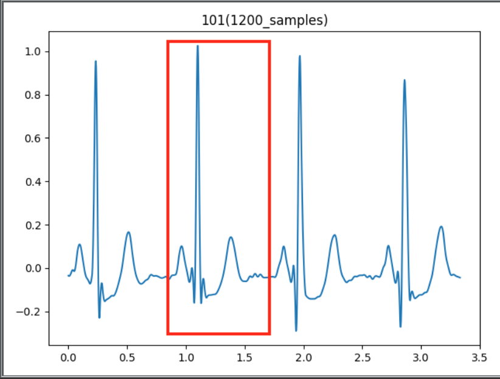
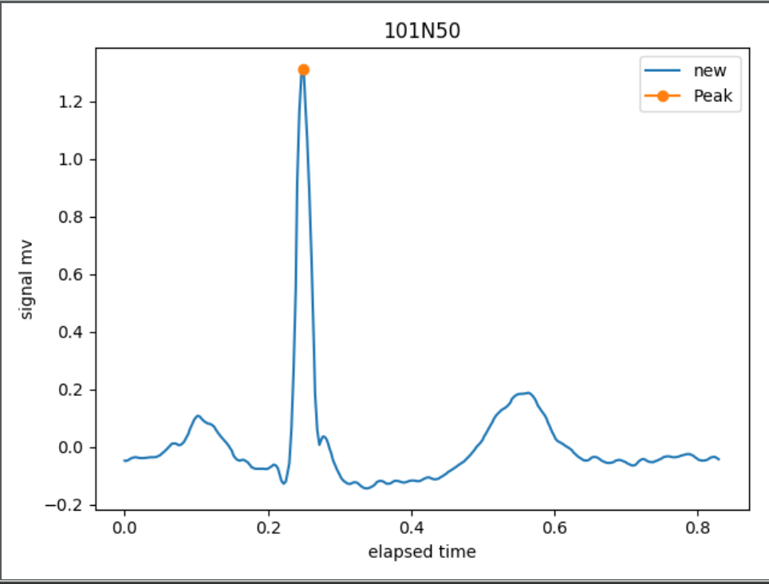
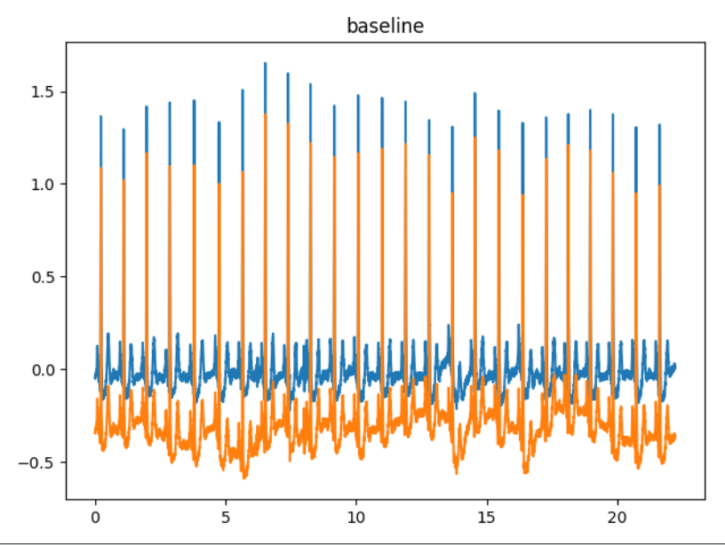
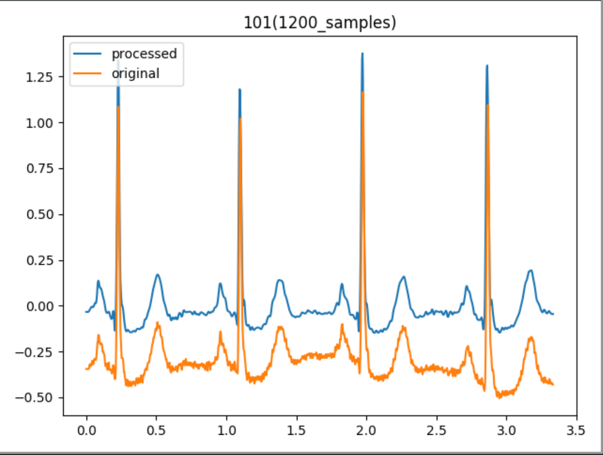
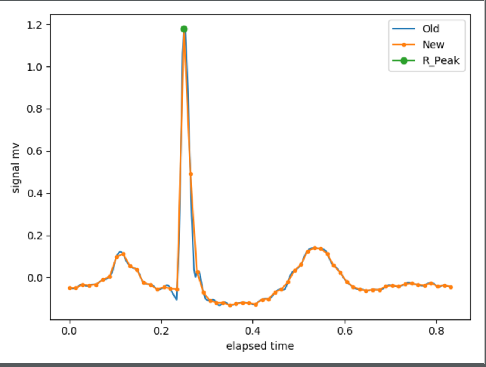
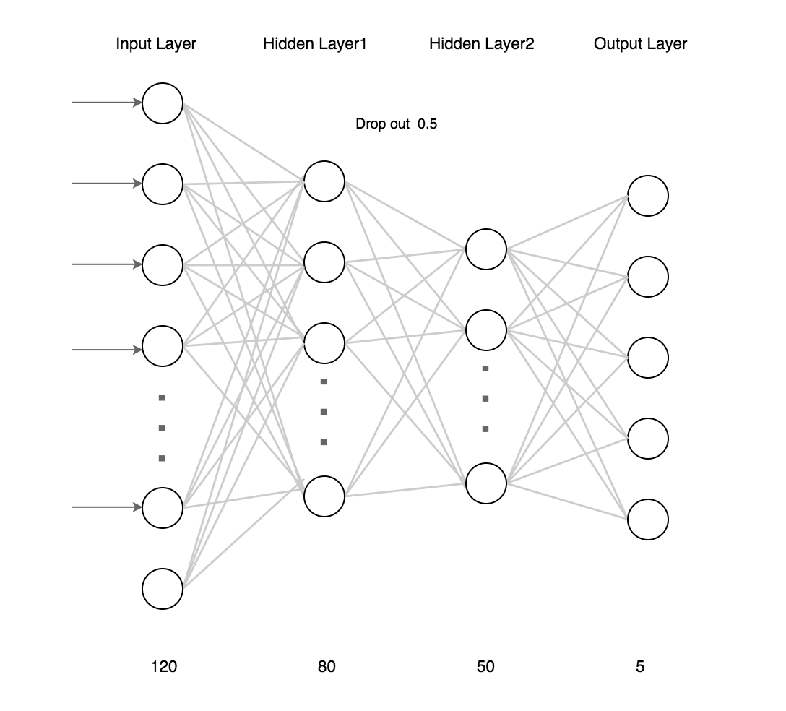
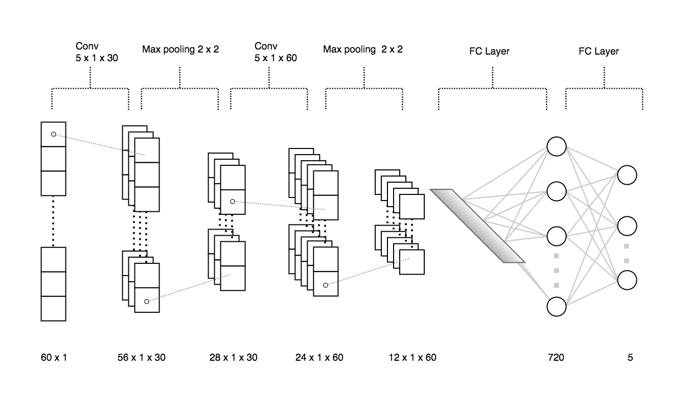

# Deep Learning for Detecting Irregular Heartbeat

## Introduction
   + Processing the signal data extracted from MIT-BIH Arrhythmia Database. 
   + Create Neural Network models to classify the ECG signal into five categories.

## Processing signal

1. Extract the annotation file from MIT-BIH arrhythmia DB
   Each row matches a heart beat, which records the time, sample index, Type and etc.

   The annotation file of patient No.100 looks like this:

   

   For instance, heart beat selected by the green line has Type A, which belongs to arrhythmia.

   All the type symbols are divided into five classifications
   ** N, VEB, SVEB, F, Q **

2. Extract the signal file from MIT-BIH arrhythmia DB
   The signal file of patient No.100 looks like this:

   

3. Slice the a series of signal by 300 window

   

4. Find the R peak of each sliced single beat

   

5. Appling Discrete Wavelet Transform (DWT) to decomping the sigal file
  + Adjust basline draft
    
    

  + Remove the High frequency noise
    
    

6. Interpolate the sigal diagram and transform from 300 signal points to 60 signal points

   
   
   Split the signals to two section, left R peak and Right of R peak.
   Process each section in  order to keep the R peak in the 60 data point.

## Sampling
  + Feature extraction
  + Undersampling and oversamping
  
    ie. 
    + Orignal Five types samples: {Normal: 77866, VEB: 5321, Q: 3822, SVEB: 2925, F: 737}
    + Resampled Five types samples: {Normal: 20000, VEB: 20000, Q: 20000, SVEB: 20000, F: 20000}

  + Split Training and Testing data
    Split 100000 samples into training and testing set. 75000 samples to training and 25000 samples to testing

## Model
  Feed Forward Neural Network (Multi-layer Neural Network)
    
   

  Covolutional Neural Network

   

  Long Short Term Memory Neural Network

## Evaluation
+ FFNN: 200 epoches
+ CNN: 50 epoches
+ LSTM: 50 epoches

Training and Testing evaluation curve
(see in evaluation folder)

Confusion Matrix
(see in evaluation folder)

Average accuracy
+ Feed Forward Neural Network Accuracy: 97.97%
+ Convolution Neural Network Accuracy: 99.37%
+ Long short term Memory Neural Network Accuracy: 99.10%
